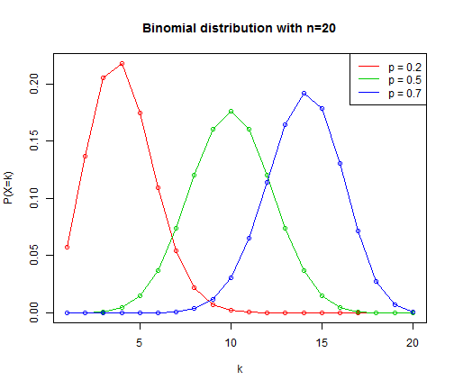
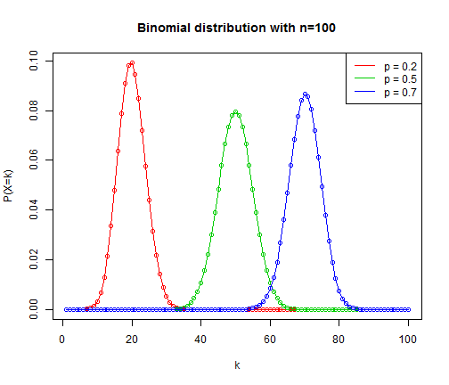
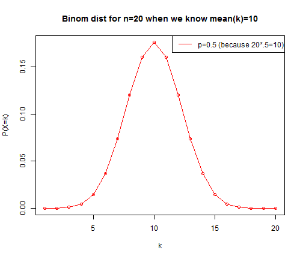
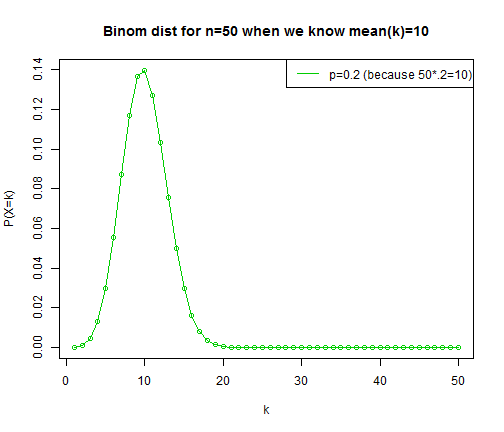
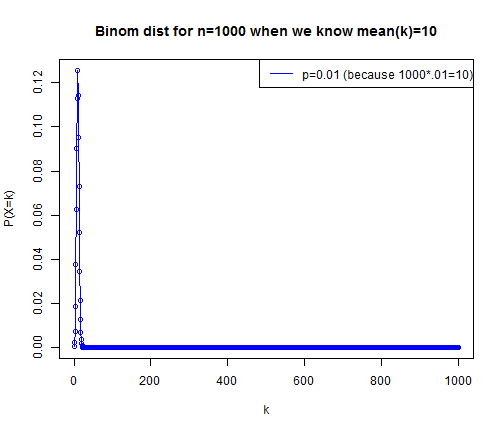
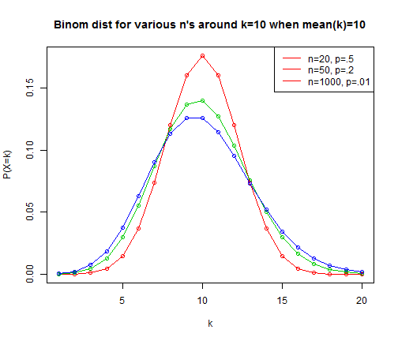
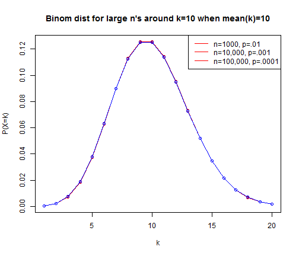

Understanding the infinity in the Poisson distribution
========================================================

The Poisson distribution gives us a probability mass for discrete natural numbers *k* given some mean value &lambda;. Knowing that, on average, &lambda; discrete events occur over some time period, the Poisson distribution gives us the probability of seeing exactly *k* events in that time period.

For example, if a store gets, on average, 123.4 customers per day, the Poisson distribution can tell us the probability of getting exactly 150 customers today.

*k* &isin; **N** because, on any particular day, you can't have a fraction of a person walk in. The probability of any non-integer number of people walking in is zero. E.g., P(150.5) = 0.

&lambda; &isin; **R** because, even though any *particular* day must have an integer number of people, the *mean* number of people taken over many days can be fractional (and usually is). It's why the "average" American family has 2.4 children.

## How we usually see binomial distribution: fixed *n*

For sample problems in probability theory, we're usually shown the binomial distribution with a fixed *n*, and asked to understand how different values of *p* will affect *k*. That is, with a fixed *n*, we see the binomial distribution as a set of curves that tell us what the probabilities are for different values of *k* on the interval [1, *n*] given different values for *p*.


```r
plot(1:20, dbinom(1:20, size = 20, prob = 0.2), type = "o", col = 2, ylab = "P(X=k)", 
    xlab = "k", main = "Binomial distribution with n=20")
points(1:20, dbinom(1:20, size = 20, prob = 0.5), type = "o", col = 3)
points(1:20, dbinom(1:20, size = 20, prob = 0.7), type = "o", col = 4)
legend("topright", legend = c("p = 0.2", "p = 0.5", "p = 0.7"), col = 2:4, lty = 1)
```

 


```r
plot(1:100, dbinom(1:100, size = 100, prob = 0.2), type = "o", col = 2, ylab = "P(X=k)", 
    xlab = "k", main = "Binomial distribution with n=100")
points(1:100, dbinom(1:100, size = 100, prob = 0.5), type = "o", col = 3)
points(1:100, dbinom(1:100, size = 100, prob = 0.7), type = "o", col = 4)
legend("topright", legend = c("p = 0.2", "p = 0.5", "p = 0.7"), col = 2:4, lty = 1)
```

 


This makes sense to us because it answers the question, "What's the probability of getting *k* heads in *n* coin flips when the probability of each individual head is *p*?" Intuitively, we understand that, when we flip the coin *n* times, the number of heads we can see ranges from 0 to *n* (inclusive).

However, formulating the question like this always assumes that we know *p*, and that *p* stays constant over different values of *n*. In other words, it us useful for imagining that some coin has an intrinsic probability of heads *p*, and then we can use this formulation to determine the probability of seeing some number of heads in ten flips, a hundred flips, a thousand flips, etc.

But what if we were to invert the problem? What if we knew only the number of heads we observed, but not the total number of flips?


## Focusing on binomial distribution at a fixed range of *k*

If we have a known expected number of heads but an unknown number of flips, then we don't really know our probability for each individual head. 

In other words, we know that, on average, *p*=mean(*k*)/*n* (thank you CLT!), but if we only have mean(*k*), then we can't actually *calculate* *p*'s value.

We can make a bunch of guesses as to what *n* must be. We know that it must be higher than ceil(mean(*k*)), obviously. But as we change our guesses for *n*, we have to also adjust the corresponding *p* so that *n* * *p* continues to equal mean(*k*).


```r
plot(1:20, dbinom(1:20, size = 20, prob = 0.5), type = "o", col = 2, ylab = "P(X=k)", 
    xlab = "k", main = "Binom dist for n=20 when we know mean(k)=10")
legend("topright", legend = "p=0.5 (because 20*.5=10)", col = 2, lty = 1)
```

 


```r
plot(1:50, dbinom(1:50, size = 50, prob = 0.2), type = "o", col = 3, ylab = "P(X=k)", 
    xlab = "k", main = "Binom dist for n=50 when we know mean(k)=10")
legend("topright", legend = "p=0.2 (because 50*.2=10)", col = 3, lty = 1)
```

 


```r
plot(1:1000, dbinom(1:1000, size = 1000, prob = 0.01), type = "o", col = 4, 
    ylab = "P(X=k)", xlab = "k", main = "Binom dist for n=1000 when we know mean(k)=10")
legend("topright", legend = "p=0.01 (because 1000*.01=10)", col = 4, lty = 1)
```

 


If we were to plot these all on the same graph in the vicinity of the same *k*, we notice something seemingly magical happens: they all have a convergent shape around mean(*k*). Of course, this isn't "magic" at all; we *made* them have this convergent shape because, no matter how much we increase *n*, we decrease *p* proportionally so that, for all *n*, the peak stays at mean(*k*).


```r
plot(1:20, dbinom(1:20, size = 20, prob = 0.5), type = "o", col = 2, ylab = "P(X=k)", 
    xlab = "k", main = "Binom dist for various n's around k=10 when mean(k)=10")
points(1:20, dbinom(1:20, size = 50, prob = 0.2), type = "o", col = 3)
points(1:20, dbinom(1:20, size = 1000, prob = 0.01), type = "o", col = 4)

legend("topright", legend = c("n=20, p=.5", "n=50, p=.2", "n=1000, p=.01"), 
    col = 2, lty = 1)
```

 


Notice that the curves get just a *little* flatter as *n* gets higher. This is because the rightward tail (not shown on this overlayed graph immediately above) keeps getting longer and longer; the part of the curve not shown to the right of the graph is much bigger for *n*=50 than *n*=1000. But, as we see from the Poisson distribution proof, the flattening is convergent...


```r
plot(1:20, dbinom(1:20, size = 1000, prob = 0.01), type = "o", col = 2, ylab = "P(X=k)", 
    xlab = "k", main = "Binom dist for large n's around k=10 when mean(k)=10")
points(1:20, dbinom(1:20, size = 10000, prob = 0.001), type = "o", col = 3)
points(1:20, dbinom(1:20, size = 1e+05, prob = 1e-04), type = "o", col = 4)

legend("topright", legend = c("n=1000, p=.01", "n=10,000, p=.001", "n=100,000, p=.0001"), 
    col = 2, lty = 1)
```

 


Intuitively, what this means is this:
"I flipped a whole bunch of coins. I don't know how many I flipped, but it was a hell of a lot. They clearly weren't fair coins, but I don't know exactly how unfair they were. Of all the hundreds or thousands or millions or whatever of coins I flipped, I counted only 10 heads. What are the chances that, the next time I flip that same enormous number of coins, I'll also get 10 heads? What is the probability I'll get 11 or 12 heads instead?"

In short, here is how the infinities in the binomial distribution cancel out to give us the Poisson distribution:
* *n* tends toward infinity, but *p* tends toward 0.
* The probability of *any particular* Bernoulli trial being a success becomes infinitessimal, but the number of different ways to arrange *k* successes in *n* trials grows infinite with *n*.
(Note that that's just two different ways of saying the same thing.)

And that's why:
* *k* is &isin; **N**. We still want to know the number of *discrete* events that take place during the course of an observation interval.
* mean(*k*) -- that is, &lambda; -- is &isin; **R**, because it represents the mean of *k*. Duh.
* *n* and *p* cancel each other out (*n* tends toward infinity but *p* tends toward 0), which is why they don't appear in the equation.
* The Poisson distribution has a long tail -- in fact, infinite. There is *some* nonzero probability that *any* integer number of events will appear. However, because the Poisson distribution is *almost* symmetric about &lambda;, it means that the sum of the probability of all those infinite integers above 2&lambda; is vanishingly small. Almost all of the mass of the Poisson distribution is between 0 and 2&lambda;. So, even though the Poisson distribution is *technically* defined over **N**, in practice it's only realistically useful in the range [0, ceil(2&lambda;)].
